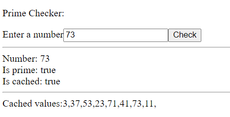

# Example Project

The idea of the project is to be a fairly simple example for new
hires of all the tech stack used in the actual Phalanx application.
<br>
The structure is similar in order for new hires to get used to the 
approach.

---

The application flow can be reviewed [here](docs/app-flow.png)

---

Structure - follows the same as phalanx, but simplified

```
 - experience
   - numbers-api - simple mn app with 2 REST endpoints access by the frontend
 - libraries
   - proto - a project containing all the generated code from .proto definitions, shared
 - process
   - workflow-api - contains only interfaces, shared
   - workflow-isprime - the implementation and worker for the workflow that checks if a number is prime
 - system
   - numbers-cache - activity and gRPC service for storing and retrieving prime numbers
   - prime-calculator - activity and gRPC service for calculating if a number is prime
   
```
---
How to run locally the application:
* Make sure to have temporal installed. It's a simple binary so you can just download it and add to path
* Run temporal dev server
```bash
temporal server start-dev
```
* Start the applications
  * numbers-cache
  * prime-calculator
  * workflow-isprime
  * numbers-api
* Start the front end
```bash
cd frontend/numbers-page
ng serve
```

How it should look when running:
